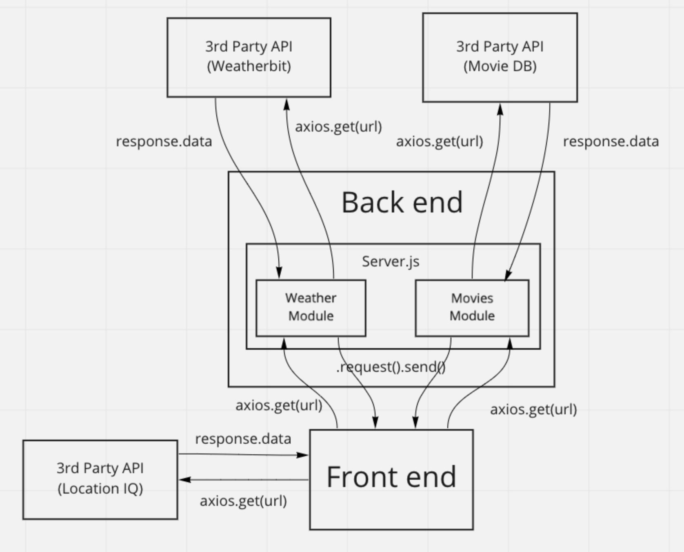

# city-explorer-api

**Author**: Branden Ge
**Version**: 1.0.4

## Overview
<!-- Provide a high level overview of what this application is and why you are building it, beyond the fact that it's an assignment for this class. (i.e. What's your problem domain?) -->

This application provides an API that responds with weather data to be consumed by any client.

## Getting Started
<!-- What are the steps that a user must take in order to build this app on their own machine and get it running? -->
1. clone the repository
2. Add your .env file with your own PORT variable and port number, per the example in .env.sample
3. Deploy to Heroku

## Architecture
<!-- Provide a detailed description of the application design. What technologies (languages, libraries, etc) you're using, and any other relevant design information. -->

This application uses JavaScript, Node.js, Express.js, cors, dotenv, and nodemon.

The architecture of this application is that this application acts as a middle layer between a client that is consuming weather data, and a 3rd party API that provides weather data (currently using JSON data as a placeholder).

Lab 6

Lab 7

Lab 8

Lab 9

## Change Log
<!-- Use this area to document the iterative changes made to your application as each feature is successfully implemented. Use time stamps. Here's an example:

01-01-2001 4:59pm - Application now has a fully-functional express server, with a GET route for the location resource. -->
08-23-2022 11:45 pm - Initial setup
08-24-2022 7:17 pm - back end and front end complete, deployed, and correctly linked up.
08-25-2022 7:00 pm - Weather and Movies APIs working and rendering
08-25-2022 12:00 am - Refactored front end and back end

## Credit and Collaborations
<!-- Give credit (and a link) to other people or resources that helped you build this application. -->
The lab demos by Audrey Patterson and Code Fellows was a big help.

1) [Lab 6 demo](https://github.com/codefellows/seattle-code-301d88/blob/main/class-06)
2) [Lab 7 demo](https://github.com/codefellows/seattle-code-301d88/tree/main/class-07)
3) [Lab 8 demo](https://github.com/codefellows/seattle-code-301d88/tree/main/class-08)

### 1) Name of feature: Set up your server repository

Estimate of time needed to complete: 1

Start time: 10:45 pm

Finish time: 11:45 pm

Actual time needed to complete: 1 hour

### 2) Name of feature: Weather data

Estimate of time needed to complete: 2 hours

Start time: 3:30 pm

Finish time: 5:30 pm

Actual time needed to complete: 2 hours

### 3) Name of feature: Error responses

Estimate of time needed to complete: 1 hour

Start time: 5:30 pm

Finish time: 7 pm

Actual time needed to complete: 1.5 hours

### 4) Name of feature: Adding weather

Estimate of time needed to complete: 2 hours

Start time: 9 pm

Finish time: 11:20 pm

Actual time needed to complete: 2 hours and 20 minutes

### 5) Name of feature: Adding movies

Estimate of time needed to complete: 2 hours

Start time: 8:30 am

Finish time: 11 am

Actual time needed to complete: 2.5 hours

### 6) Name of feature: Deploying

Estimate of time needed to complete: 1 hour

Start time: 4:45 pm

Finish time: 5:45

Actual time needed to complete: 1 hour

### 7) Name of feature: Refactor back end into separate server.js, weather.js, and movies.js

Estimate of time needed to complete: 2 hours

Start time: 7 pm

Finish time: 8 pm

Actual time needed to complete: 1 hour
