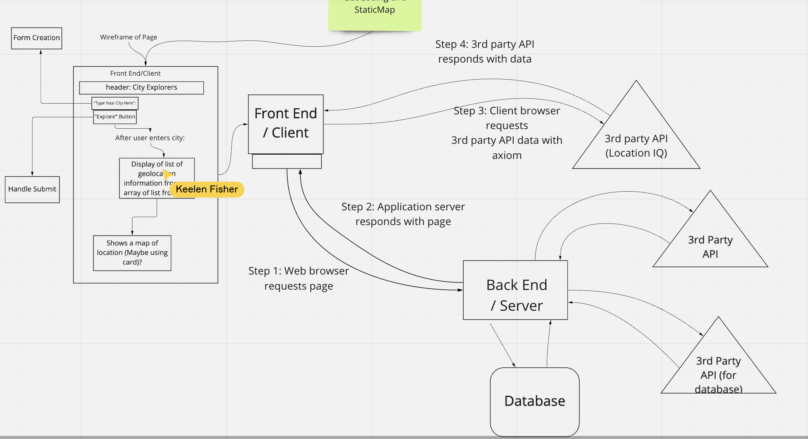
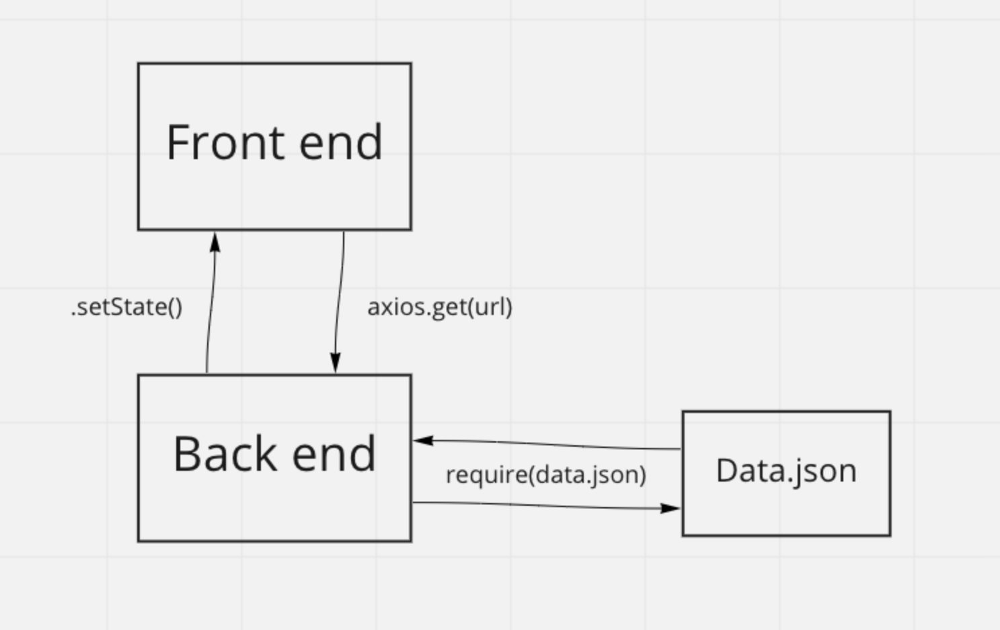
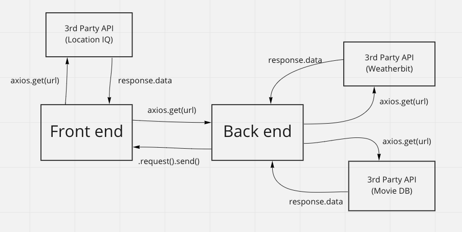
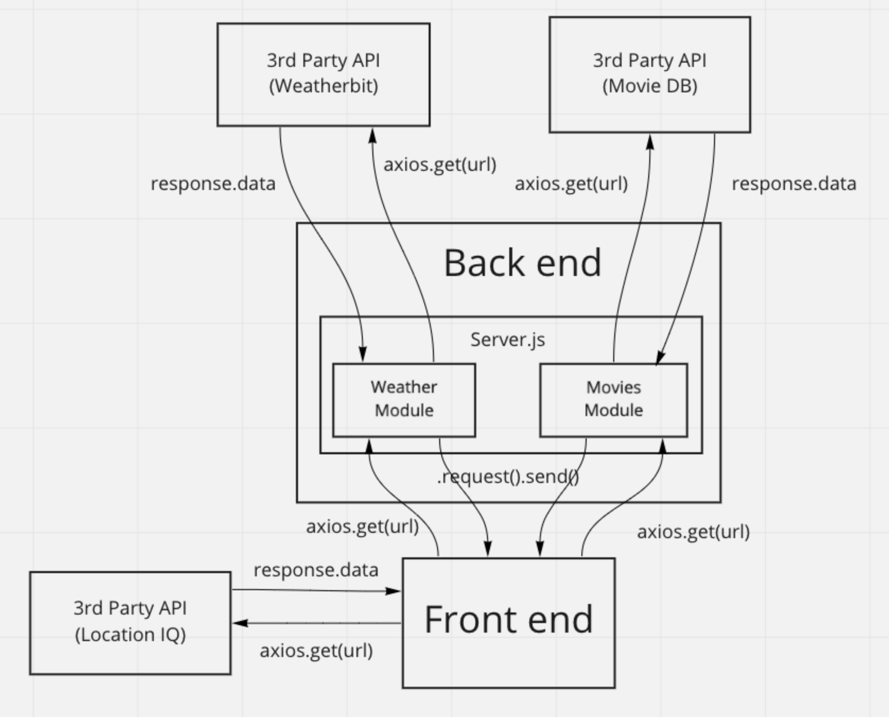

# City Explorer

**Author**: Branden Ge
**Version**: 1.0.4

## Overview
<!-- Provide a high level overview of what this application is and why you are building it, beyond the fact that it's an assignment for this class. (i.e. What's your problem domain?) -->

This application provides a way of searching the latitude and longitude coordinates of any U.S. city, as well as generating a map of the city.

## Getting Started
<!-- What are the steps that a user must take in order to build this app on their own machine and get it running? -->

1. Fork this repo
2. Set up a free Location IQ account
3. Create your own .env file and put your token in there, following the same syntax as provided in .env.sample

## Architecture
<!-- Provide a detailed description of the application design. What technologies (languages, libraries, etc) you're using, and any other relevant design information. -->

The below diagram repesents 3 different ways that 3rd party APIs can be used:

1. The front end acts as middle layer between the back end and a 3rd party API. This is necessary when user input events trigger the API call, or are needed to do the API call.
2. The back end uses a 3rd party API directly in conjunction with a database.
3. The back end uses a 3rd party API directly without any database.

This application currently only uses the 1st interaction. The request-response cycle in this case is:

1. The client browser requests the page from the server hosting the application.
2. The server responds with the html, css, javascript, and other assets to render the page.
3. The client triggers an event with a call to a 3rd party API, sending out an AJAX request (the getCityData function in this case, using Axios promises).
4. The 3rd party API responds to the client (the promise is settled).
5. The client receives the data and stores it in the browser and re-renders the page with it.

Lab 6

Lab 7

Lab 8

Lab 9

This application uses React, Bootstrap, React Bootstrap, the Axios library, and the Location IQ API.

## Change Log
<!-- Use this area to document the iterative changes made to your application as each feature is successfully implemented. Use time stamps. Here's an example:

01-01-2001 4:59pm - Application now has a fully-functional express server, with a GET route for the location resource. -->

08-22-2022 7:15 pm - Initial setup
08-22-2022 10:32 pm - Feature 1 for setup and Feature 2 for latitude and longitude
08-22-2022 11:45 pm - Feature 3 for displaying the map
08-25-2022 7:00 pm - Weather and Movies APIs working and rendering
08-25-2022 12:00 am - Refactored front end and back end

## Credit and Collaborations
<!-- Give credit (and a link) to other people or resources that helped you build this application. -->
The lab demos by Audrey Patterson and Code Fellows was a big help.

1) [Lab 6 demo](https://github.com/codefellows/seattle-code-301d88/blob/main/class-06)
2) [Lab 7 demo](https://github.com/codefellows/seattle-code-301d88/tree/main/class-07)
3) [Lab 8 demo](https://github.com/codefellows/seattle-code-301d88/tree/main/class-08)
4) [Lab 9 demo](https://github.com/codefellows/seattle-code-301d88/tree/main/class-09)

## Time Estimates

### 1) Name of feature: Set up your React repository & API keys

Estimate of time needed to complete: 1 hour

Start time: 7:15

Finish time: 8:15

Actual time needed to complete: 1 hour

### 2) Name of feature: Locations - enter location name to see exact latitude and longitude of location

Estimate of time needed to complete: 2 hours

Start time: 8:15

Finish time: 10:35

Actual time needed to complete: 2 hours and 20 minutes

### 3) Name of feature: Map - display a map

Estimate of time needed to complete: 2 hours

Start time: 10:35

Finish time: 11:45

Actual time needed to complete: 1 hour and 10 minutes

### 4) Name of feature: Errors - add error handling

Estimate of time needed to complete: 1 hour

Start time: 11:45

Finish time: 12:05

Actual time needed to complete: 20 minutes

### 5) Name of feature: Refactor back end into separate server.js, weather.js, and movies.js

Estimate of time needed to complete: 2 hours

Start time: 8:30 pm

Finish time: 11:30 pm

Actual time needed to complete: 3 hours
