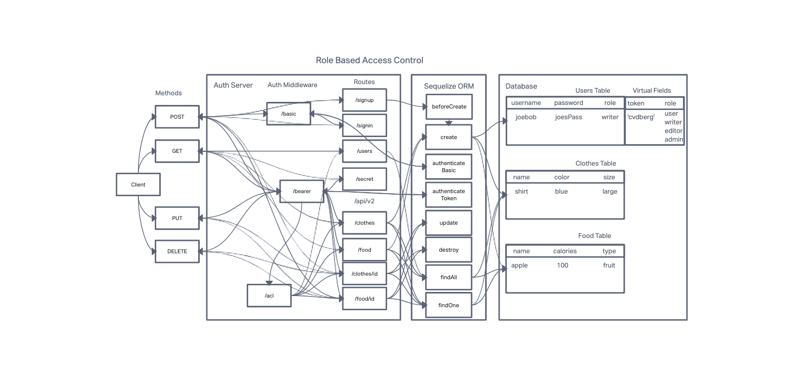

# LAB - Class 08

## Project: Auth API

### Author: Branden Ge

### Problem Domain

This lab demonstrates how to implement an Express API complete with authentication and authorization functionality.

- [CI/CD GitHub Actions](https://github.com/brandenge/auth-api/actions)
- [Back-end server url production](https://auth-api-88.herokuapp.com/)

### Setup

`.env` Environments variables set as shown in the `.env.sample`

- `PORT`
- `DATABASE_URL`
- `SECRET`

#### Running the app

- `npm start` or `nodemon` (if you have nodemon) to start the application.

#### Features / Routes

v1 Model Routes

- GET : `/api/v1/clothes` or `/api/v1/food`
- GET : `/api/v1/clothes/id` or `/api/v1/food/id`
- POST : `/api/v1/clothes` or `/api/v1/food`
- PUT : `/api/v1/clothes/id` or `/api/v1/food/id`
- DELETE : `/api/v1/clothes/id` or `/api/v1/food/id`

v2 Model Routes with Authentication

- GET : `/api/v2/clothes` or `/api/v2/food`
- GET : `/api/v2/clothes/id` or `/api/v2/food/id`
- POST : `/api/v2/clothes` or `/api/v2/food`
- PUT : `/api/v2/clothes/id` or `/api/v2/food/id`
- DELETE : `/api/v2/clothes/id` or `/api/v2/food/id`

Auth Routes

- POST : `/signup`
- POST : `/signin`
- GET : `/users`
- GET : `/secret`

Other Routes

- GET : `*` - catch-all route which always responds with a 404 Not Found error.

#### Tests

- `npm test` to run tests

#### UML Diagram

Diagram created with [InVision](https://www.invisionapp.com/)

#### Credits: [Demo code from Ryan Gallaway at Code Fellows](https://github.com/codefellows/seattle-code-javascript-401d48/tree/main/class-08/inclass-demo)
