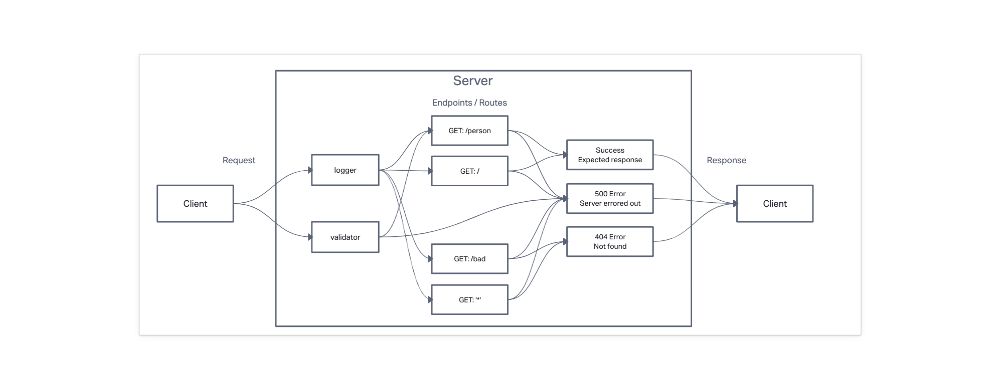

# LAB - Class 02

## Project: Basic Express Server

### Author: Branden Ge

### Problem Domain

This lab demonstrates how to test an Express server, including mocking the server for testing, and testing its middleware.

- [CI/CD GitHub Actions](https://github.com/brandenge/basic-express-server/actions)
- [Back-end server url production](https://basic-express-server-88.herokuapp.com/)

### Setup

- Add `.env` file with a `PORT` variable set to a port number as shown in the `.env.sample`.

#### Running the app

- `npm start` or `nodemon` (if you have nodemon) to start the application.

#### Features / Routes

- GET : `/` - root.
- GET : `/person` - checks the query string for a name property, returns a json object with a name property and the name.
- GET : `/bad-route-error-string` - calls next with an error string. Used to test the validator.
- GET : `/bad-route-error-object` - throws a new error object. Used to test the validator.
- GET : `*` - catch-all route which always responds with a 404 Not Found error.

#### Tests

- `npm test` to run tests

#### UML Diagram

Diagram created with [InVision](https://www.invisionapp.com/)

Credits: [Demo code from Ryan Gallaway at Code Fellows](https://github.com/codefellows/seattle-code-javascript-401d48/tree/main/class-02/inclass-demo)
