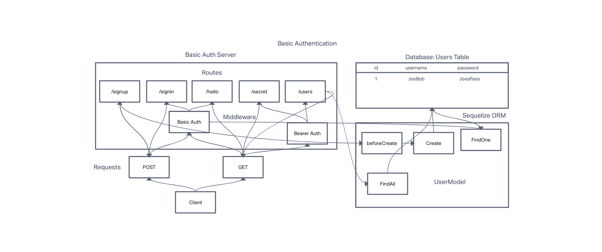

# LAB - Class 07

## Project: Bearer Auth

### Author: Branden Ge

### Problem Domain

This lab demonstrates how to implement using bearer tokens to allow a user to access restricted routes that require authentication.

- [CI/CD GitHub Actions](https://github.com/brandenge/bearer-auth/actions)
- [Back-end server url production](https://bearer-auth-88.herokuapp.com/)

### Setup

`.env` Environments variables set as shown in the `.env.sample`

- `PORT`
- `DATABASE_URL`
- `SECRET`

#### Running the app

- `npm start` or `nodemon` (if you have nodemon) to start the application.

#### Features / Routes

- POST : `/signup`
- POST : `/signin`
- GET : `/users`
- GET : `/secret`
- GET : `/hello?name=value` - requires a `name` query parameter
- GET : `*` - catch-all route which always responds with a 404 Not Found error.

#### Tests

- `npm test` to run tests

#### UML Diagram

Diagram created with [InVision](https://www.invisionapp.com/)

#### Credits: [Demo code from Ryan Gallaway at Code Fellows](https://github.com/codefellows/seattle-code-javascript-401d48/tree/main/class-07/inclass-demo)
