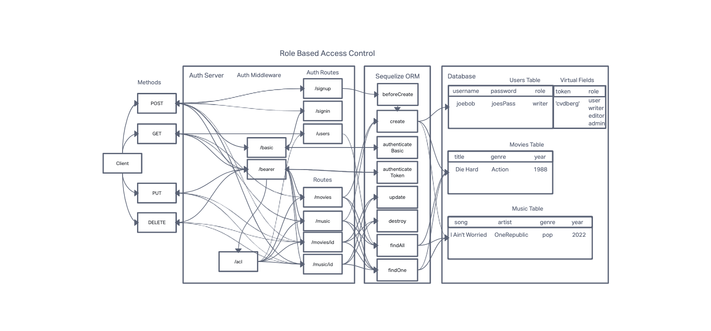

# LAB - Class 09

## Project: BT Auth API for Music and Movies

### Authors: Branden Ge and Tim Traylor

### Problem Domain

This lab demonstrates how to implement an Express API complete with authentication and authorization functionality, restricting access to routes that manipulate a database with music and movie information. It also features a comprehensive automated test suite.

- [CI/CD GitHub Actions](https://github.com/TTraylor310/bt-auth-api/actions)
- [Back-end server url production](https://bt-auth-api-88.herokuapp.com/)

### Setup

`.env` Environments variables set as shown in the `.env.sample`

- `PORT`
- `DATABASE_URL`
- `SECRET`

#### Running the app

- `npm start` or `nodemon` (if you have nodemon) to start the application.

#### Features / Routes

Model Routes

- GET : `/movies` or `/music`
- GET : `/movies/id` or `/music/id`
- POST : `/movies` or `/music`
- PUT : `/movies/id` or `/music/id`
- DELETE : `/movies/id` or `/music/id`

Auth Routes

- POST : `/signup`
- POST : `/signin`
- GET : `/users`

Other Routes

- GET : `*` - catch-all route

#### Tests

- `npm test` to run tests

#### UML Diagram

Diagram created with [InVision](https://www.invisionapp.com/)

#### Credits: [Demo code from Ryan Gallaway at Code Fellows](https://github.com/codefellows/seattle-code-javascript-401d48/tree/main/class-09/inclass-demo)
