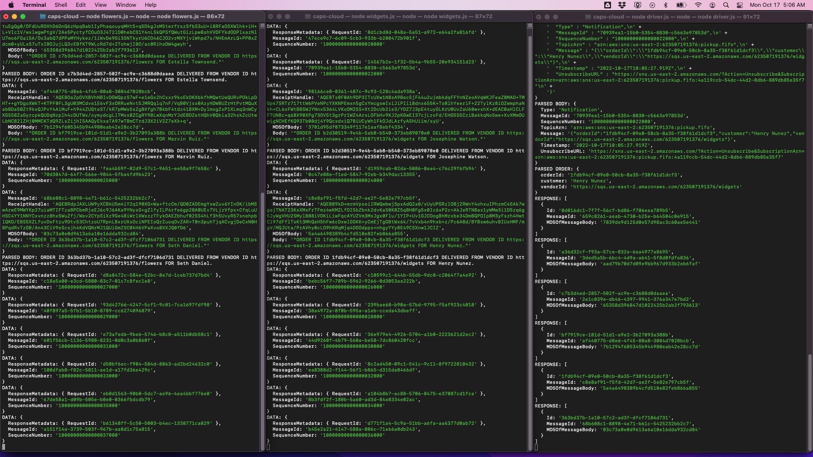
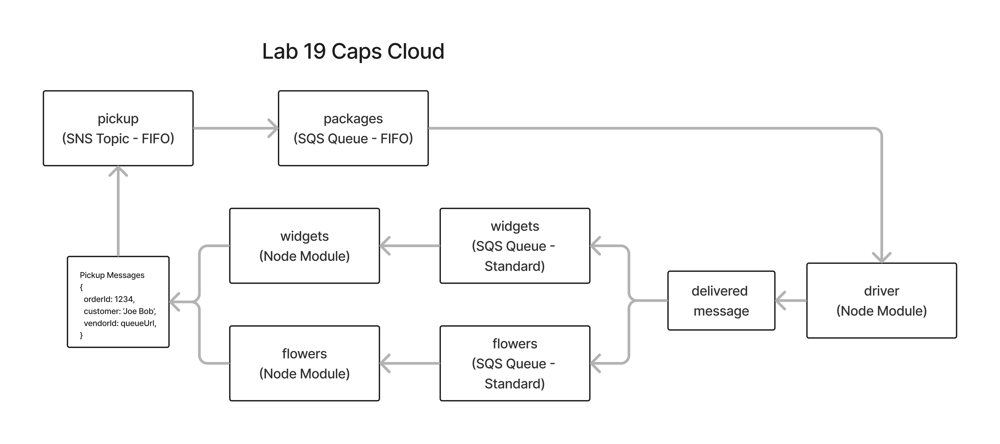

# LAB - Class 19

## Project: CAPS Cloud

### Author: Branden Ge

### Problem Domain

This lab demonstrates how to create and deploy an event-driven application using AWS Services: SQS, SNS, and Lambda.

#### Running the app

- `node flowers.js` to send a flower order to the SNS pickup notification, and poll its queue for delivery confirmations.
- `node widgets.js` to send a widgets order to the SNS pickup notification, and poll its queue for delivery confirmations.
- `node driver.js` to poll the packages queue and send delivery confirmations to the respective queue for the vendor of the order.

#### Data Flow

1) Vendors modules (widgets.js and flowers.js) publish a new order to the pickup.fifo SNS Topic.
2) SNS publishes the new order to the packages.fifo SQS queue, which is subscribed to it.
3) Drivers modules (driver.js) consumes the packages.fifo SQS queue.
4) Drivers modules (driver.js) produces a delivery message to the respective vendor SQS queue for the order.
5) Vendors modules (widgets.js and flowers.js) consume their respective delivery SQS queues to receive the delivery confirmation.

#### Console

#### Processes

1) Create a pickup.fifo SNS topic
2) Create a packages.fifo SQS queue
3) Create a SQS standard queue for each vendor for delivery notifications
4) Subscribe the packages queue to the pickup topic notification
5) Create vendor modules (such as flowers and widgets) that publish messages for orders to the pickup SNS
6) Create a driver module that subscribes to/consumes the packages queue.
7) Send delivery confirmation messages from the driver module to the SQS standard queue for the respective vendor of each order.

#### Whiteboard

Diagram created with [Figma](https://www.figma.com/)

#### Credits: [Demo code from Ryan Gallaway at Code Fellows](https://github.com/codefellows/seattle-code-javascript-401d48/tree/main/class-19/inclass-demo)
