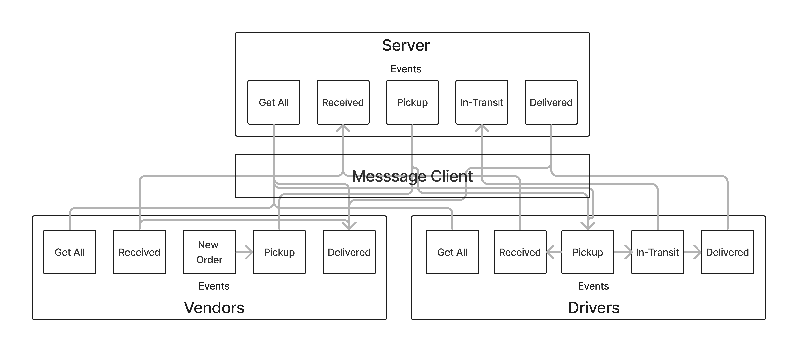

# LAB - Class 13

## Project: Code Academy Parcel Service (CAPS) Phase 3 Messages Queue

### Authors: Branden Ge

### Problem Domain

This lab demonstrates how to implement an event-driven application using Socket.io. Socket connections are established via Socket.io, and then a series of event listeners and event emitters pass messages to each other.

This example mimics a delivery service passing messages regarding the updated status of a shipped package that is sent from vendors to delivery truck drivers. A server hub runs in the middle, in-between the vendors and the drivers, acting as an intermediary and forwarding messages from vendors to drivers and from drivers to vendors.

This lab also implements a messages queue that will store messages until their receipt is confirmed. Whenever a client connects to the server, it retrieves any messages in its queue.

- [GitHub Repo](https://github.com/brandenge/code-academy-parcel-service-3)

### Setup

- N/A

#### Running the app

Start the server and clients in the specified order:

1) Run `node server/index.js` to start the server hub event listeners.
2) Run `node drivers/index.js` to start the drivers event listeners and emitters.
3) Run `node vendors/index.js` to start the vendor event listeners and emitters.

#### Features / Routes

Events

1) NEW_ORDER - emitted from vendors to itself to trigger the entire event chain.
2) PICKUP - emitted from vendors
3) IN-TRANSIT - emitted from drivers
4) DELIVERED - emitted from drivers
5) RECEIVED - emitted from both vendors and drivers
6) GET_ALL - emitted from both vendors and drivers

Event emitters from the server to vendors use Socket.io rooms that are specific to each vendor.

#### UML Diagram

Diagram created with [InVision](https://www.figma.com/)

#### Credits: [Demo code from Ryan Gallaway at Code Fellows](https://github.com/codefellows/seattle-code-javascript-401d48/tree/main/class-13/inclass-demo)
