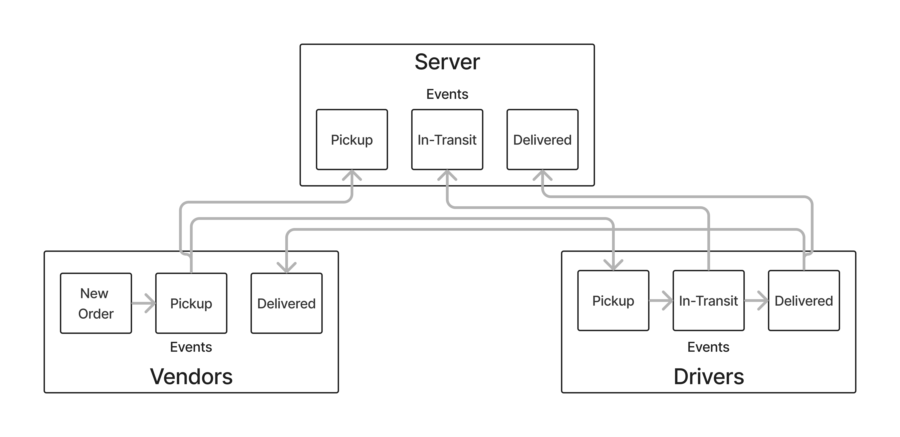

# LAB - Class 11

## Project: Code Academy Parcel Service (CAPS)

### Authors: Branden Ge

### Problem Domain

This lab demonstrates how to implement an event-driven application using Node Events. A series of event listeners and event emitters pass messages to each other.

This example mimics a delivery service passing messages regarding the updated status of a shipped package that is sent from vendors to delivery truck drivers.

- [GitHub Repo](https://github.com/brandenge/code-academy-parcel-service)

### Setup

- N/A

#### Running the app

- Run `node server/hub.js` to start the `server` hub event listeners. This also starts the event listeners and emitters in `vendors` and `drivers`.

#### Features / Routes

Events

1) New Order - emitted from vendorEvents to itself to trigger the entire event chain.
2) Pickup - emitted from vendorEvents
3) In-Transit - emitted from driverEvents
4) Delivered - emitted from driverEvents

#### UML Diagram

Diagram created with [Figma](https://www.figma.com/)

#### Credits: [Demo code from Ryan Gallaway at Code Fellows](https://github.com/codefellows/seattle-code-javascript-401d48/tree/main/class-11/inclass-demo)
